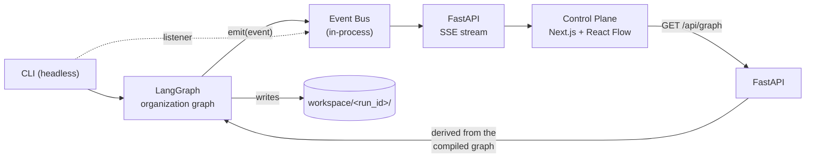

# DataLab OS

A local-first, hierarchical **agentic data science organization**, with a live **Control Plane** that shows the
workflow executing.

> Status: **Proof of Concept**. It proves two things: (1) a LangGraph workflow that runs an organization of
> agents end to end, and (2) a web control plane that observes that execution in real time.

## What is DataLab OS?

The long-term goal is an organization of AI agents that takes a business problem and raw data to analysis,
experimentation, a validated model, a dashboard and an executive report:

```text
                    HEAD OF DATA SCIENCE
        ┌───────────────────┼────────────────────┐
  DATA ENGINEERING       ANALYTICS          DATA SCIENCE
        └───────────────────┼────────────────────┘
                       REVIEW LEAD
                            │
                    DATA PRODUCT LEAD   (MVP)
```

This repository implements only the PoC slice of that vision (tabular binary classification).

## PoC architecture

**LangGraph is the source of truth.** The frontend never orchestrates anything: it observes events and draws.



The workflow (linear in the PoC):

```text
START → head_ds → data_engineering → analytics → modeling → review → report → END
```

### One graph definition, no drift

`src/datalab/graphs/organization.py` holds the only workflow definition (`NODES` + `EDGES`). It builds the
LangGraph, and `GET /api/graph` reads the nodes/edges **back from the compiled graph**. The Control Plane draws
whatever that endpoint returns, so there is no second, hand-maintained frontend graph. (`lib/types.ts` mirrors
the event/graph JSON contract; it is types only, not workflow.)

### Departments and subgraphs

Each department is one node function (`agents/<lead>.py::run`) wrapped by a common step that emits the events
(`agent_started`, handoffs, `agent_completed`/`agent_failed`). That function is the seam where a department
becomes its own subgraph later. I did not create empty `graphs/data_engineering.py`-style modules yet.

### Two modes

| Mode | What runs | Artifacts |
|---|---|---|
| **demo workflow** | every node sleeps briefly and writes a placeholder. **No data is read, no result is produced.** | `<node>.demo.json`, `report.md` (says "DEMO WORKFLOW") |
| **real run** | CSV profiling → EDA → Logistic Regression baseline → methodological review → report | `problem.yaml`, `data_profile.json`, `eda.json`, `experiments.json`, `review.json`, `report.md` |

The review checks: baseline exists, train/test split exists, seed recorded, all metrics present, and **target
leakage** (target or a declared `leakage_columns` used as a feature, a numeric feature with |r| ≥ 0.95 with the
target, or a suspiciously perfect ROC AUC). It returns `APPROVED` or `REJECTED`; a rejected run still writes a
`report.md` that says so, and ends with `run_rejected`.

`configs/problem.leaky.yaml` points to a dataset with an undeclared copy of the target, so you can watch a
rejection.

### Events

One Pydantic contract (`src/datalab/schemas/event.py`), one `EventBus.emit` call for agents/graphs:

```json
{"seq": 12, "event_id": "evt_0012", "run_id": "run_…", "timestamp": "…", "event_type": "handoff_started",
 "department": "analytics", "agent": null, "status": null, "target": "modeling", "message": "analytics -> modeling", "data": {}}
```

Types: `run_started`, `run_completed`, `run_rejected`, `run_failed`, `agent_started`, `agent_status`,
`agent_completed`, `agent_failed`, `handoff_started`, `handoff_completed`, `artifact_created`,
`review_started`, `review_completed`. (`agent_status` and `run_failed` go beyond the initial list: the first
feeds an agent's "current task", the second closes the stream when a node crashes.)

`status` is the node's (or run's) status after the event: `waiting | running | completed | rejected | error`.
The bus is in-memory; the SSE endpoint is just a listener, so swapping the transport touches no agent code.
`handoff_started` lights up the edge, `handoff_completed` settles it (the backend holds a handoff for
`DATALAB_HANDOFF_DELAY` seconds, 0.6 by default, purely so it is visible).

## Control Plane

`apps/control-plane`: Next.js + TypeScript + `@xyflow/react`. A **live execution viewer**, not a workflow
builder: you can pan, zoom, select and move nodes for readability, but that never changes the workflow.

- One node per agent/department with name, role, status (○ waiting · ● running · ✓ completed · ✕ rejected · ! error) and elapsed time.
- Edges: idle → **active** (animated, during a handoff) → done.
- Click a node: status, current task, inputs (artifacts of upstream nodes), artifacts, start time, duration, recent activity: all derived from the run's events.
- Activity feed on the same SSE stream. Reloading the page re-attaches to the run (`?run=<id>`) by replaying its events.
- Header: `LOCAL`, whether Ollama is in use, demo/real, run status, and buttons to start runs.

Design choices: plain CSS with light/dark tokens instead of shadcn/ui (about six simple components did not justify the extra dependencies).

## Local-first, zero API cost

Everything runs on your machine. No paid API, no cloud, no keys. The only LLM provider is a **local Ollama**
(`qwen3:8b` by default), used in two places in real runs: the Head of DS plan brief and the report summary.
Every generated text is labelled with its source (`ollama:qwen3:8b` or `deterministic`). If Ollama is
unreachable, or `DATALAB_LLM=off`, the run uses a plain deterministic text and says so; nothing is mocked
silently. Demo runs never call an LLM.

## How to run

Requirements: Python 3.11+, Node 20+. Ollama is optional.

Backend (PowerShell):

```powershell
cd C:\Users\mathe\Documents\projects\datalab-os
python -m venv .venv
.\.venv\Scripts\Activate.ps1
pip install -e ".[dev]"
uvicorn datalab.api.app:app --reload
```

Frontend (another terminal):

```powershell
cd C:\Users\mathe\Documents\projects\datalab-os\apps\control-plane
npm install
npm run dev
```

Open <http://localhost:3000> (use `localhost`, not `127.0.0.1`, in dev mode) and press **Run demo**, **Run real**
or **Run real (leaky)**. The API expects to be at `http://127.0.0.1:8000` (`NEXT_PUBLIC_API_URL` to change it).

Headless, no frontend and no API needed:

```powershell
python -m datalab.main --demo
python -m datalab.main --config configs/problem.example.yaml
python -m datalab.main --config configs/problem.example.yaml --no-llm   # never call Ollama
```

Exit code: 0 completed, 2 rejected by the review, 1 error. Artifacts land in `workspace/<run_id>/`.

Tests:

```powershell
pytest                              # backend
cd apps\control-plane; npm test; npm run lint; npm run build
```

Configuration is via environment variables or a `.env` (see `.env.example`).
The bundled datasets in `data/raw/` are synthetic (`python -m datalab.tools.sample_data` regenerates them).

### API

| | |
|---|---|
| `GET /health` | status and whether the local LLM is available |
| `GET /api/graph` | nodes/edges of the organization (from the compiled LangGraph) |
| `POST /api/runs` | `{"mode": "demo" \| "real", "config": "problem.example"}` → 202 + run info |
| `GET /api/runs/{id}` | run info (status, artifacts, review verdict) |
| `GET /api/runs/{id}/events` | all events so far |
| `GET /api/runs/{id}/stream` | Server-Sent Events: replay + live, closes after the terminal event; honours `Last-Event-ID` |

## Current limitations

- Runs and events live in memory (artifacts are on disk): restarting the API forgets run history.
- The workflow is linear and each department is a single node; there are no subagents or subgraphs yet.
- Only `tabular_binary_classification`; one baseline model (Logistic Regression); no tuning.
- The review's leakage check is a heuristic (numeric near-copies, declared columns, perfect AUC); it can miss subtle leaks.
- Hypotheses are simple correlation statements, not tested hypotheses.
- With Ollama enabled, a real run can take over a minute (model load and two generations).
- The event contract is mirrored by hand in `lib/types.ts`.
- One run executes in one thread; there is no queue, cancellation, retry or pause/resume.

## Roadmap

**PoC** (this repo): LangGraph · Ollama-ready · FastAPI · SSE · React Flow · agent states · activity feed · basic DS pipeline · artifacts · review.

**MVP**: hierarchical subagents · Data Product Team · DataViz agent · `dashboard_spec.json` · generated dashboard · executive report · Great Expectations · Evidently · MLflow · human approval · run history.

**Strong version**: Red Team · Phoenix observability · model benchmark and routing · agent evals · retry · pause/resume · run replay · task graph · persistent memory · MCP · Graphify · worktrees · Loop Engineering concepts · advanced orchestration.

## Layout

```text
configs/            problem definitions (YAML)
data/raw/           bundled synthetic samples
workspace/<run>/    artifacts of each run (git-ignored)
src/datalab/
  graphs/organization.py   the single workflow definition
  agents/                  one module per lead (+ demo.py)
  tools/                   profiling, eda, baseline, review
  services/                event bus, run service, artifacts, run context
  api/                     FastAPI app, runs, graph, SSE
  schemas/  state.py  main.py (CLI)  llm.py  config.py
apps/control-plane/        Next.js + React Flow
tests/
```
