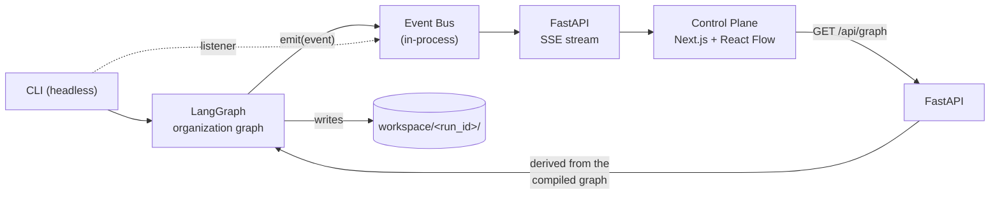

# DataLab OS

A local-first, hierarchical **agentic data science organization**, with a live **Control Plane** that shows the
workflow executing.

> Status: **PoC + hierarchical department subgraphs**. It proves (1) a LangGraph workflow that runs an
> organization of departments and agents end to end, and (2) a web control plane that observes that
> hierarchical execution in real time.

## What is DataLab OS?

The long-term goal is an organization of AI agents that takes a business problem and raw data to analysis,
experimentation, a validated model, a dashboard and an executive report:

```text
                    HEAD OF DATA SCIENCE
        ┌───────────────────┼────────────────────┐
  DATA ENGINEERING       ANALYTICS          DATA SCIENCE
        └───────────────────┼────────────────────┘
                       REVIEW LEAD
                            │
                    DATA PRODUCT LEAD   (MVP)
```

This repository implements only the PoC slice of that vision (tabular binary classification).

## PoC architecture

**LangGraph is the source of truth.** The frontend never orchestrates anything: it observes events and draws.



### Hierarchy: organization graph → department subgraphs → agents

```text
organization graph (LangGraph)
│
├─ head_ds                      Head of Data Science
├─ data_engineering  ← compiled subgraph
│    engineering_lead → data_profiler → data_quality_analyst
├─ analytics         ← compiled subgraph
│    analytics_lead → eda_analyst → hypothesis_analyst
├─ modeling          ← compiled subgraph ("Data Science")
│    ds_lead → baseline_modeler → model_evaluator
├─ review                       Review Lead (independent methodological verdict)
└─ report
```

Each department is a real compiled `StateGraph` (`graphs/data_engineering.py`, `analytics.py`, `modeling.py`,
built by `graphs/steps.py`) added as a node of the organization graph in `graphs/organization.py`; LangGraph
itself runs the child agents. Inside a department the agents run **sequentially and deterministically**. This is
specialized orchestration, not dynamic multi-agent collaboration: there is no parallelism, no dynamic delegation
and no agent-to-agent negotiation.

### One graph definition, no drift

The only workflow definition is Python: the order of `UNITS` in `graphs/organization.py` and the agent tuple of
each `DepartmentSpec`. `GET /api/graph` does **not** re-declare it: `graphs/topology.py` reads the structure back
from the *compiled* LangGraph (`get_subgraphs()` for the real subgraphs, `get_graph(xray=True)` for the
executable nodes and the edges between them, cross-department handoffs included) and only joins display metadata
(label, role, type) from the specs. If the specs and the compiled graph disagree, the topology refuses to build.
The Control Plane draws what that endpoint returns and knows no node name: a new agent is a backend change and it
shows up in the UI by itself. (`lib/types.ts` mirrors the JSON contract; it is types only, not workflow.)

### Modes and agent responsibilities

Both modes execute the **same topology** (all 12 executable nodes and the same handoffs).

| Node | Real run | Artifact |
|---|---|---|
| `head_ds` | validates the problem, writes the plan brief (Ollama or deterministic text) | `problem.yaml` |
| `data_engineering.engineering_lead` | checks the CSV header against the declared target/id/leakage columns; records the column list | none (plan goes to state) |
| `data_engineering.data_profiler` | loads the CSV; rows, columns, dtypes, missing, duplicates, target distribution | `data_profile.json` |
| `data_engineering.data_quality_analyst` | quality findings from the profile (no reload) | `data_quality.json` |
| `analytics.analytics_lead` | requires profile + quality; chooses the columns for EDA | none |
| `analytics.eda_analyst` | numeric/categorical summaries, correlations, target rate | `eda.json` |
| `analytics.hypothesis_analyst` | correlational hypotheses from the EDA (no causal claims) | `hypotheses.json` |
| `modeling.ds_lead` | requires profile + EDA; checks class counts; fixes features, split and seed (the experiment plan) | none |
| `modeling.baseline_modeler` | trains the Logistic Regression baseline on that plan | `experiments.json` |
| `modeling.model_evaluator` | selects the experiment, checks metrics exist, compares with a majority-class predictor. **Descriptive only** | `model_evaluation.json` |
| `review` | independent methodological verdict: `APPROVED` / `REJECTED` (baseline, split, seed, metrics, target leakage) | `review.json` |
| `report` | assembles the report (Ollama summary or deterministic text) | `report.md` |

The leads are deliberately thin: they validate prerequisites and produce the small plan their team consumes.
Only `head_ds` and `report` may call Ollama; the analytical agents are deterministic.

**Demo workflow:** every agent sleeps briefly and writes a `<agent>.demo.json` placeholder (and `report.md` says
"DEMO WORKFLOW"). **No data is read and no result is produced**: it demonstrates the topology only.

`configs/problem.leaky.yaml` points to a dataset with an undeclared copy of the target; the whole hierarchy runs
and the `review` rejects it (the model evaluator still completes: it never approves or rejects anything).

The review checks: baseline exists, train/test split exists, seed recorded, all metrics present, and **target
leakage** (target or a declared `leakage_columns` used as a feature, a numeric feature with |r| ≥ 0.95 with the
target, or a suspiciously perfect ROC AUC). A rejected run still writes a `report.md` that says so, and ends
with `run_rejected`. Columns declared in the problem (`target`, `id_columns`, `leakage_columns`) that are missing
from the dataset now fail the run in `engineering_lead` instead of being ignored silently.

### Events and identifiers

One Pydantic contract (`src/datalab/schemas/event.py`), one `EventBus.emit` call for agents/graphs:

```json
{"seq": 21, "event_id": "evt_0021", "run_id": "run_…", "timestamp": "…", "event_type": "handoff_started",
 "node_id": "data_engineering.data_quality_analyst", "department": "data_engineering",
 "agent": "data_quality_analyst", "status": null, "target": "analytics.analytics_lead",
 "message": "Data Quality Analyst → Analytics Lead", "data": {}}
```

| Field | Meaning |
|---|---|
| `node_id` | the graph node the event is about; **the key the control plane indexes state by**. `head_ds`, `review`, `report` for top-level nodes; the department id (`data_engineering`) for the department container; `<department>.<agent>` for an agent. `null` for run-level events |
| `department` | the top-level unit the node belongs to: the department id for a container and its agents, the node's own id for top-level nodes |
| `agent` | the agent's local id; `null` for department containers and run events |
| `target` | for handoffs: the **executable** `node_id` receiving control (`node_id` is the sender), e.g. `analytics.hypothesis_analyst` → `modeling.ds_lead` |
| `status` | status of `node_id` (or of the run) after the event: `waiting \| running \| completed \| rejected \| error` |

Ids are machine ids (`[a-z][a-z0-9_]*`, joined with `.`), validated when the specs are created; display labels are
never used as identifiers. Department lifecycle uses the existing event types on the container's `node_id`:

```text
handoff_completed → department agent_started → first agent … last agent agent_completed
→ department agent_completed → handoff_started (to the next unit's first agent)
```

If an agent raises: `agent_failed` for the agent, `agent_failed` for its department, then `run_failed`; nothing
downstream starts. Types: `run_started`, `run_completed`, `run_rejected`, `run_failed`, `agent_started`,
`agent_status`, `agent_completed`, `agent_failed`, `handoff_started`, `handoff_completed`, `artifact_created`,
`review_started`, `review_completed`. Every `artifact_created` carries the producing agent's `node_id`.

The bus is in-memory; the SSE endpoint is just a listener, so swapping the transport touches no agent code.
`handoff_started` lights up the edge, `handoff_completed` settles it (the backend holds a handoff for
`DATALAB_HANDOFF_DELAY` seconds, 0.6 by default, purely so it is visible).

## Control Plane

`apps/control-plane`: Next.js + TypeScript + `@xyflow/react`. A **live execution viewer**, not a workflow
builder: you can pan, zoom, select and move nodes for readability, but that never changes the workflow.

- Departments are **container nodes** (React Flow parent/child) that visually group their agents; each agent and each department has its own status (○ waiting · ● running · ✓ completed · ✕ rejected · ! error) and elapsed time. A department's status comes from the backend's department lifecycle events, not from a client-side rule.
- Edges (the executable edges served by `/api/graph`): idle → **active** (animated, during a handoff) → done. Both handoffs inside a department and between departments animate.
- Click an agent: status, current task, inputs (artifacts of upstream nodes), artifacts it produced, start time, duration, recent activity. Click a department: its agents (clickable) and their statuses, the running agent, aggregated artifacts and activity. Everything is derived from the run's events.
- Layout is deterministic and computed from `parent_id` + edges (no layout dependency): departments stack top to bottom, agents flow left to right inside them, so a reload draws the same picture.
- Activity feed on the same SSE stream. Reloading the page re-attaches to the run (`?run=<id>`) by replaying its events.
- Header: `LOCAL`, whether Ollama is in use, demo/real, run status, and buttons to start runs.

Design choices: plain CSS with light/dark tokens instead of shadcn/ui (about six simple components did not justify the extra dependencies).

## Local-first, zero API cost

Everything runs on your machine. No paid API, no cloud, no keys. The only LLM provider is a **local Ollama**
(`qwen3:8b` by default), used in two places in real runs: the Head of DS plan brief and the report summary.
Every generated text is labelled with its source (`ollama:qwen3:8b` or `deterministic`). If Ollama is
unreachable, or `DATALAB_LLM=off`, the run uses a plain deterministic text and says so; nothing is mocked
silently. Demo runs never call an LLM.

## How to run

Requirements: Python 3.11+, Node 20+. Ollama is optional.

Backend (PowerShell):

```powershell
cd C:\Users\mathe\Documents\projects\datalab-os
python -m venv .venv
.\.venv\Scripts\Activate.ps1
pip install -e ".[dev]"
uvicorn datalab.api.app:app --reload
```

Frontend (another terminal):

```powershell
cd C:\Users\mathe\Documents\projects\datalab-os\apps\control-plane
npm install
npm run dev
```

Open <http://localhost:3000> (use `localhost`, not `127.0.0.1`, in dev mode) and press **Run demo**, **Run real**
or **Run real (leaky)**. The API expects to be at `http://127.0.0.1:8000` (`NEXT_PUBLIC_API_URL` to change it).

Headless, no frontend and no API needed:

```powershell
python -m datalab.main --demo
python -m datalab.main --config configs/problem.example.yaml
python -m datalab.main --config configs/problem.example.yaml --no-llm   # never call Ollama
```

Exit code: 0 completed, 2 rejected by the review, 1 error. Artifacts land in `workspace/<run_id>/`.

Tests:

```powershell
pytest                              # backend
cd apps\control-plane; npm test; npm run lint; npm run build
```

Configuration is via environment variables or a `.env` (see `.env.example`).
The bundled datasets in `data/raw/` are synthetic (`python -m datalab.tools.sample_data` regenerates them).

### API

| | |
|---|---|
| `GET /health` | status and whether the local LLM is available |
| `GET /api/graph` | the organization read back from the compiled LangGraph: `nodes` (`id, label, role, type, agent, parent_id`; type is `orchestrator \| department \| agent \| review \| report`) and `edges` (`id, source, target, kind`; kind is `internal` inside a department, `handoff` between units) |
| `POST /api/runs` | `{"mode": "demo" \| "real", "config": "problem.example"}` → 202 + run info |
| `GET /api/runs/{id}` | run info (status, artifacts, review verdict) |
| `GET /api/runs/{id}/events` | all events so far |
| `GET /api/runs/{id}/stream` | Server-Sent Events: replay + live, closes after the terminal event; honours `Last-Event-ID` |

## Current limitations

- Runs and events live in memory (artifacts are on disk): restarting the API forgets run history.
- Departments are real subgraphs, but each is a fixed, linear, sequential chain of agents: no parallel branches, no dynamic agent spawning, no delegation decided at run time. The leads only validate and plan.
- Agents share data through small JSON state and files, not in memory: the CSV is re-read by the profiler, the EDA analyst and the modeler (the quality analyst, hypothesis analyst and evaluator work from state).
- The topology helpers assume each department is a linear chain; a department with parallel entry/exit agents would need its lifecycle rule (first started / last completed) revisited.
- Control plane buttons name two config files (`problem.example`, `problem.leaky`) that live in `configs/`.
- Only `tabular_binary_classification`; one baseline model (Logistic Regression); no tuning.
- The review's leakage check is a heuristic (numeric near-copies, declared columns, perfect AUC); it can miss subtle leaks.
- Hypotheses are simple correlation statements, not tested hypotheses.
- With Ollama enabled, a real run can take over a minute (model load and two generations).
- The event contract is mirrored by hand in `lib/types.ts`.
- One run executes in one thread; there is no queue, cancellation, retry or pause/resume.

## Roadmap

**Implemented now**: LangGraph organization graph · Ollama-ready · FastAPI · SSE · React Flow · agent states · activity feed · basic DS pipeline · artifacts · review · **department subgraphs with specialized sequential agents** · hierarchical events (`node_id`) · graph metadata read from the compiled graph · department containers in the Control Plane.

**Future: MVP**: dynamic / parallel subagents · Data Product Team · DataViz agent · `dashboard_spec.json` · generated dashboard · executive report · Great Expectations · Evidently · MLflow · human approval · run history.

**Future: strong version**: Red Team · Phoenix observability · model benchmark and routing · agent evals · retry · pause/resume · run replay · task graph · persistent memory · MCP · Graphify · worktrees · Loop Engineering concepts · advanced orchestration.

## Development workflow

This repo is built with a small team of *development* agents (`.claude/agents/`), distinct from the runtime
DataLab agents. See [`docs/agents/TEAM_ORCHESTRATION.md`](docs/agents/TEAM_ORCHESTRATION.md): one task, one owner,
bounded handoffs, independent evaluation and review; Git history stays with the maintainer.

## Layout

```text
configs/            problem definitions (YAML)
data/raw/           bundled synthetic samples
workspace/<run>/    artifacts of each run (git-ignored)
src/datalab/
  graphs/organization.py   top-level graph (UNITS), compiles the department subgraphs
  graphs/<department>.py   DepartmentSpec: label, role and ordered agents of a department
  graphs/steps.py          builds subgraphs; wraps every node with its events
  graphs/topology.py       reads nodes/edges/hierarchy back from the compiled graph (/api/graph)
  agents/                  one module per agent (+ demo.py)
  tools/                   profiling, eda, baseline, evaluation, review
  services/                event bus, run service, artifacts, run context
  api/                     FastAPI app, runs, graph, SSE
  schemas/  state.py  main.py (CLI)  llm.py  config.py
apps/control-plane/        Next.js + React Flow
tests/
```
