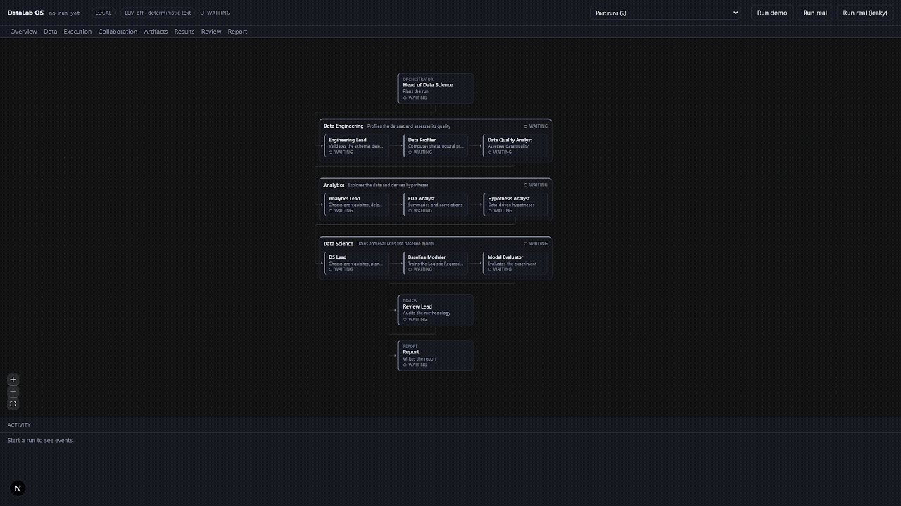
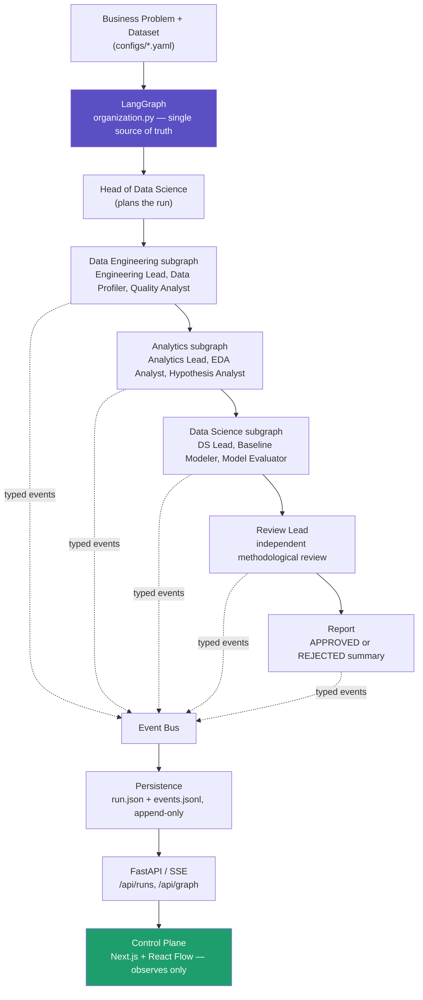

<div align="center">

# DataLab OS

### A local-first, observable AI organization for Data Science

**A real LangGraph pipeline of specialized Data Science agents — profiling, EDA, modeling, and an
independent methodological review — with every decision, tool call, and handoff visible in a live console.**

<br>


</div>

---

## Demo



*(placeholder — recorded from a real run; see [docs/DEMO.md](docs/DEMO.md) for the script and
[docs/assets/README.md](docs/assets/README.md) for capture instructions)*

---

## 1. What this project demonstrates

- **Real orchestration, not prompt chaining** — the workflow is a compiled LangGraph graph of
  department subgraphs, not a loop over one LLM call.
- **Specialized, deterministic agents** — profiling, quality checks, EDA, hypotheses, baseline
  modeling and evaluation each call real `pandas`/`scikit-learn` functions, not free-form generation.
- **An independent Review agent that can reject its own organization's work** — a structural
  incentive, not a rubber stamp (see §7).
- **Full observability without chain-of-thought** — every agent action, tool call, artifact and
  handoff is a typed event, replayable from disk, never a raw LLM prompt.
- **A frontend that only observes** — the Control Plane reads the same event stream and graph
  topology the backend produces; it never re-implements or re-decides the workflow.
- **Local-first** — zero paid APIs; the one optional LLM call (Ollama) narrates finished text and
  always has a labeled deterministic fallback.
- **Engineering discipline** — 118 backend tests, 97 frontend tests, clean lint, clean production
  build (exact commands in §10).

## 2. Architecture



Each `[department]` above is a **real compiled LangGraph subgraph** (`graphs/<department>.py`, built by
`graphs/steps.build_department`) — a node of the top-level graph in `graphs/organization.py`. Everything
the Control Plane draws (nodes, nesting, edges) is read back from that compiled graph by
`graphs/topology.py` and served at `GET /api/graph`; topology is never re-declared in TypeScript. The
frontend has no execution logic of its own — it renders events and artifacts it receives.

## 3. Why this is actually multi-agent

Each department is a bounded agent with its own state slice, its own real tool calls (visible in the
console as `Tools used`), and output that becomes the next agent's *input artifact*, not a chat message.
Agents hand off through LangGraph edges that carry typed state (`DataLabState`) and named artifacts
(`data_profile.json`, `experiments.json`, ...) — never a shared scratchpad or raw conversation history.

The clearest evidence this isn't one model wearing different hats: the **Review Lead is adversarial to
the rest of the organization**. It re-derives its own checks (`baseline_exists`, `train_test_split_exists`,
`seed_recorded`, `metrics_exist`, `no_target_leakage`) from the Data Science team's own artifacts and can
mark the entire run `REJECTED` — including flagging a feature the modeling team used that the Review Lead
alone identifies as near-duplicate of the target (§7).

**What the current PoC does not do**, so the claim stays honest: no dynamic agent spawning, no emergent
or negotiated collaboration, no autonomous arbitrary re-planning of the graph, and no parallel department
execution — `organization.py` documents this directly: *"Execution inside a department is sequential and
deterministic; there is no parallelism or dynamic delegation."* Those are roadmap items (§12), not what
ships today.

## 4. Operations Console

`localhost:3000` is an **AI Data Science Operations Console** over the real run, not a chat UI:

| Tab | Shows |
|---|---|
| **Overview** | run id, status, problem, dataset, target, current phase, elapsed time, verdict, model + main metric |
| **Data** | dataset facts from `data_profile.json`/`data_quality.json` and a bounded row preview — never the full dataset |
| **Execution** | the live LangGraph hierarchy (React Flow), node status, Activity Feed |
| **Collaboration** | a Handoff Timeline derived purely from real events (`agent_started`, `handoff_*`, `artifact_created`, ...) — every entry traces to one real `event.seq`; no generated dialogue |
| **Artifacts** | every artifact the run produced, opened in a safe, path-checked viewer |
| **Results** | selected model, metrics table, APPROVED/REJECTED banner |
| **Review** | the Review Lead's real checklist, pass/fail, and final verdict, rendered verbatim |
| **Report** | the final Markdown report, rendered in place |

Nothing here is a scripted demo of "agents talking" — the Collaboration timeline and every inspector panel
are read models over the same events persisted to `events.jsonl`.

## 5. Successful and rejected workflow examples

Three configs ship in `configs/` for exactly this purpose:

- **`problem.small.yaml`** — ~205-row dataset, fastest way to see the full pipeline end to end.
- **`problem.example.yaml`** — a clean churn dataset; expected to run through to **APPROVED**.
- **`problem.leaky.yaml`** — same problem, but the dataset hides an undeclared copy of the target
  (`account_closed_flag`). The Review Lead's `no_target_leakage` check computes the correlation itself
  and **REJECTS** the run — the console shows the exact failing detail, e.g. *"feature(s) almost
  identical to the target: account_closed_flag (r=+1.000)"* — verbatim from `review.json`, not authored
  by the frontend.

## 6. Technical design

- **State** — `DataLabState` is small and JSON-like (TypedDict-based); no DataFrames or model objects
  ever sit in graph state.
- **Events** — every node emits typed `ExecutionEvent`s over an in-process Event Bus, streamed live via
  SSE (`GET /runs/{id}/stream`) and persisted append-only to `events.jsonl`, with `run.json` written
  atomically for restart-safe recovery and historical replay.
- **Tool metadata** — agents report the real function/library they called (e.g.
  `pandas.read_csv`, `sklearn.linear_model.LogisticRegression`) as `data.tools` on their completion
  event — never invented, absent on older runs shown as "not recorded."
- **Ollama is optional and narration-only** — used only by `head_ds` (plan brief) and `report`
  (executive summary); every call falls back to clearly labeled deterministic text
  (`brief_source: "deterministic (ollama unavailable)"`) and never touches analytical logic.
- **Path-safe artifact access** — `GET /runs/{id}/artifacts/{name}` looks `name` up as a dict key in
  that run's own server-written artifact registry; a name is either a real key or a 404, so there is no
  path to join or traverse.
- **Reproducibility** — fixed seed (42), explicit train/test split, metrics recorded per run.

## 7. How to run

```powershell
# Backend
python -m venv .venv
.\.venv\Scripts\pip install -e ".[dev]"
copy .env.example .env                      # optional — Ollama config, all defaults work without it
uvicorn datalab.api.app:app --reload         # http://127.0.0.1:8000

# Frontend
cd apps\control-plane
npm install
npm run dev                                  # http://localhost:3000
```

Trigger a run from the CLI (or from the Control Plane once both are up):

```powershell
python -m datalab.main --config configs\problem.example.yaml   # expect APPROVED
python -m datalab.main --config configs\problem.leaky.yaml     # expect REJECTED
python -m datalab.main --demo                                  # no dataset, no analytical claims
```

## 8. Verification

```powershell
.\.venv\Scripts\python.exe -m pytest -q                        # 118 passed

cd apps\control-plane
npm test                                                        # 97 passed
npm run lint                                                    # clean
npm run build                                                   # clean production build
```

## 9. Current limitations

- Sequential, deterministic execution only — no parallel departments, no dynamic agent spawning.
- The Head of Data Science writes a fixed plan brief; it does not re-plan or reshape the graph at
  runtime.
- Tabular binary classification only, validated on small synthetic/sample datasets.
- No production hardening: no auth, no multi-tenancy, no retry/pause/resume.
- Historical dataset preview needs the original CSV still present on disk (it isn't copied into the run
  directory).

## 10. Roadmap

- Broaden beyond tabular binary classification to more task types.
- Parallel execution *where it is actually safe* (e.g. independent EDA sub-tasks), kept explicit and
  observable — not implicit concurrency.
- Deeper experiment tracking and data-quality tooling.
- Additional local model backends alongside Ollama.

---

<div align="center">

Built as a proof of concept. Every claim above is backed by code in this repository — see §6 for where.

</div>
